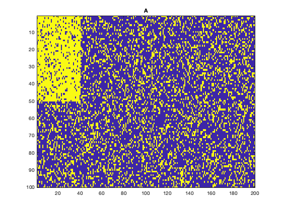
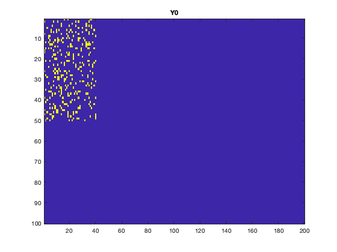
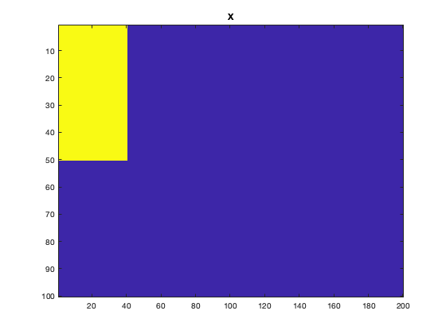
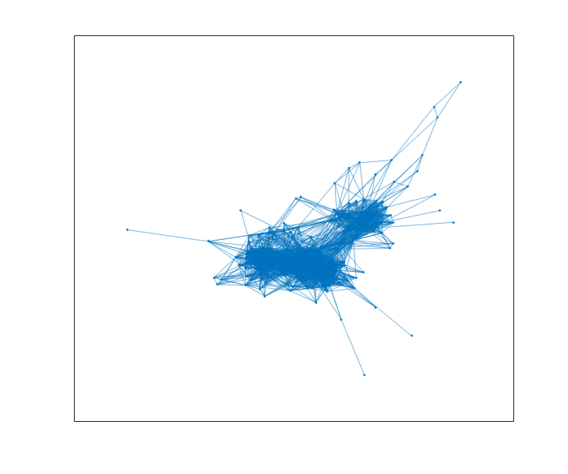
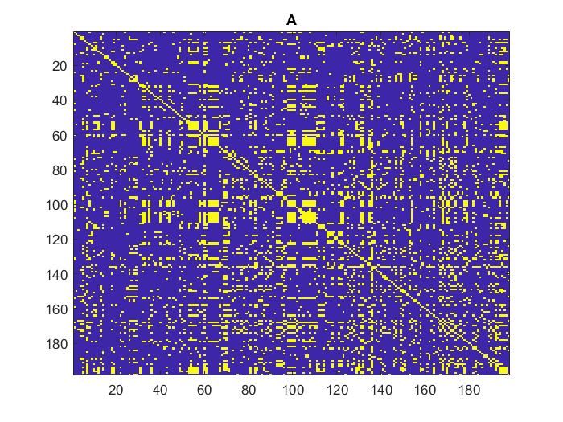
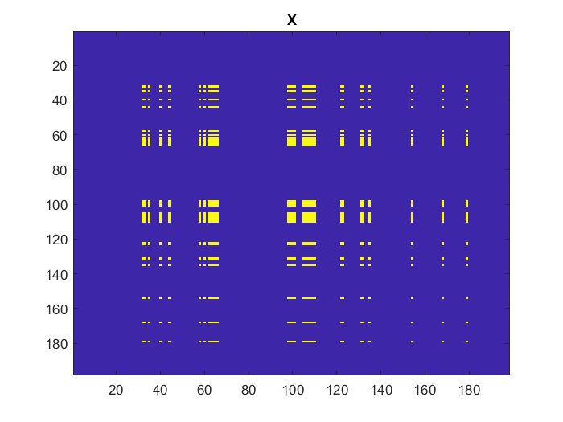

# admmDensestSubmatrix_Matlab  


# Introduction
This is the `Matlab`-code for the paper entitled [Convex optimization for the densest subgraph and densest submatrix problems](https://arxiv.org/abs/1904.03272).

See also [`R`-package](https://github.com/pbombina/admmDensenstSubmatrix).

The problem of identifying a dense submatrix is a fundamental problem in the  analysis of matrix structure and complex networks. This code provides tools for identifying the densest submatrix of the fixed size in a given graph/matrix using first-order optimization methods.

See the tutorial below to get started.

# Usage
`Matlab`-archive contains the following functions:
- `plantedsubmatrix.m` generates binary matrix sampled from dense submatrix of particular size
- `densub.m` ADMM algorithm for our relaxation of the densest subgraph and submatrix problems
- `mat_shrink.m` soft-threholding operator applied to vector of singular values (used in X-update step of `densub.m`)

# Examples
We test this package on two different types of data: first, using random matrices sampled from the planted dense m x n submtarix model and, second, real-world collaboration and communication networks.

## Random matrices
We generate a random matrix with noise obscuring the planted submatrix using the function ``plantedsubmatrix`` and then call the function ``densub`` to recover the planted submatrix.

```Matlab
% Initialize problem sizes and densities
M = 100; %number of rows of sampled matrix
N = 200; %number of columnss of sampled matrix
m = 50; %number of rows of dense submatrix
n = 40; %number of columns of dense submatrix
p = 0.25; %noise density
q = 0.85; %in-group density

% Make binary matrix with planted mn-submatrix
[A,X0,Y0] = plantedsubmatrix(M,N,m,n,p,q);

```

After generating the random matrix with desired planted structure, we can visually represent the matrix and planted submatrix as two-tone images, where dark pixels correspond to nonzero entries, and light pixels correspond to zero entries.

```Matlab
% Plot A and matrix representations
figure; imagesc(A);  hold('on'); title('A'); hold('off')% plot matrix.
figure; imagesc(X0);  hold('on'); title('X0'); hold('off')
figure; imagesc(Y0);  hold('on'); title('Y0'); hold('off') % plot matrix representation of submatrix.

```
Tne vizualization of the randomly generated matrix  helps us to understand its structure. It is clear that it contains a dense 50 x 40 block (top left corner).



We remove all noise and isolate an image of a rank-one matrix X0 with mn nonzero entries.


Then we vizualize matrix Y0 to see the number of disagreements between original matrix A and X0.



We call the ADMM solver and visualize the output:

```Matlab
%% CALL DENSUB SOLVER.

% Initialize parameters and settings.
tau = 0.35; %regularization parameter
maxiter = 500; %max number of iterations
verbose = 1;
opt_tol = 1e-4; %optimal tolernce
gamma = 6/(sqrt(m*n)*(q-p)); %optimal choice of gamma from paper.

% Call solver.
[X,Y,Q, iter] = densub(A,m,n, gamma,tau, opt_tol, maxiter, verbose);

% Display iteration/convergence status
if iter < maxiter
    % Converged.
    fprintf('Algorithm converged after %d iterations.\n', iter) 
else
    % Failed to converge.
    fprintf('Algorithm failed to converge within %d iterations.\n', maxiter)
end

```
The ADMM solver returns the optimal solutions X and Y. 

It must be noted that matrices X and Y are identical to the actual structures of X0 and Y0. The planted submatrix is recovered.

```Matlab
% Plot results.
figure; imagesc(X); hold('on'); title('X'); hold('off')
figure; imagesc(Y); hold('on'); title('Y'); hold('off')
```




## Collaboration Network
The following is an example on how one could use the package to analyze the collaboration network found in the JAZZ dataset (see [Community Structure in Jazz. Gleiser and Danon. 2003](https://arxiv.org/abs/cond-mat/0307434)).
This is a social/collaboration network where each pair of musicians are linked if they have performed together. The maximum clique in this network contains 30 musicians.



The data is stored as an adjacency list (see `jazz.txt`) which we convert to a dense adjacency matrix using the script `ListIntoAdjMat.m`.

```Matlab
%% Create adjacency matrix A from jazz.txt.
ListIntoAdjMat
jazzA = A + eye(size(A));
figure; imagesc(jazzA);  hold('on'); title('A'); hold('off')% plot matrix.
```

This yields the perturbed adjacency matrix given in the following figure.



We are now ready to try to identify the densest submatrix of size 30 in this adjacency matrix. Here, we set $m=n=30$ in our call to `densub`. 

```Matlab
m = 30; % clique size or the number of rows of the dense submatrix 
n = 30; % clique size of the number of columns of the dense submatrix
tau = 0.35; % regularization parameter
opt_tol = 1e-4; % optimal tolerance
verbose = 1;
maxiter = 2000; % max number of iterations 
gamma = 25/n; % regularization parameter

tic % start a stopwatch timer to measure performance

% Call ADMM solver 

[X,Y,Q, iter] = densub(jazzA, m, n, gamma,tau, opt_tol, maxiter, verbose); 

toc %stop a stopwatch timer
 

%%converges in 90 iterations for gamma=25/n
%%Elapsed time is 0.442105 seconds.

```

Our algorithm finds the maximum clique, corresponding to the group of musicians indexed by nonzero entries of $X$ visualized below.



# How to contribute
- Fork, clone, edit, commit, push, create pull request
- Use Matlab

# Reporting bugs and other issues
If you encounter a clear bug, please file a minimal reproducible example on github.
